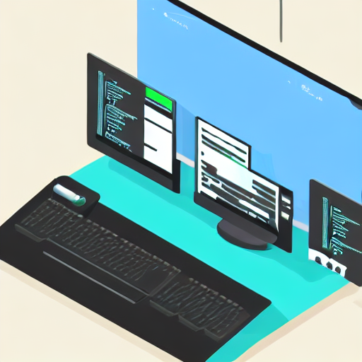

# 🎮 C Game Project - The Witcher Inspired RPG

[](https://en.wikipedia.org/wiki/C_(programming_language))
[](https://www.libsdl.org/)
[](#supported-platforms)
[](LICENSE)
[](makefile)

> A feature-rich 2D RPG game built in C using SDL2, inspired by The Witcher universe. Features include character management, enemy AI, puzzle mechanics, mini-games, and a complete game world with sound effects and animations.



## ✨ Game Features

### 🎯 Core Gameplay
- **Character System**: Complete player character with health, inventory, and progression
- **Enemy AI**: Intelligent enemy behavior and combat mechanics
- **Quest System**: Enigmas and puzzles to solve throughout the game
- **Mini-Games**: Various mini-tasks and challenges
- **Map System**: Explorable game world with different areas

### 🎨 Graphics & Interface
- **SDL2 Graphics**: Hardware-accelerated 2D rendering
- **Animated Sprites**: Smooth character and environment animations
- **Menu System**: Professional-looking menus with mouse and keyboard support
- **HUD Elements**: Health bars, inventory display, and game status
- **Visual Effects**: Particle effects and screen transitions

### 🔊 Audio System
- **Background Music**: Immersive soundtrack with multiple tracks
- **Sound Effects**: Interactive audio feedback for actions
- **Audio Controls**: Volume adjustment and music selection
- **SDL_mixer Integration**: Professional audio mixing capabilities

### 🎮 Input & Controls
- **Keyboard Controls**: Arrow keys, WASD, and hotkeys
- **Mouse Support**: Click interactions and menu navigation
- **Fullscreen Toggle**: Seamless windowed/fullscreen switching
- **Responsive Input**: Smooth and accurate control handling

### 🧩 Game Mechanics
- **Puzzle Solving**: Logic-based challenges and riddles
- **Combat System**: Turn-based or real-time combat mechanics
- **Inventory Management**: Item collection and usage system
- **Time System**: Day/night cycle and time-based events
- **Save/Load System**: Game progress persistence

## 🚀 Quick Start

### Prerequisites

**Linux (Ubuntu/Debian):**
```bash
sudo apt update
sudo apt install build-essential libsdl2-dev libsdl2-image-dev libsdl2-mixer-dev libsdl2-ttf-dev
```

**Linux (Fedora/CentOS):**
```bash
sudo dnf install gcc make SDL2-devel SDL2_image-devel SDL2_mixer-devel SDL2_ttf-devel
```

**Windows:**
- Install MinGW or Visual Studio
- Download SDL2 development libraries
- Set up environment variables

**macOS:**
```bash
brew install sdl2 sdl2_image sdl2_mixer sdl2_ttf
```

### Installation & Compilation

1. **Clone the repository**
   ```bash
   git clone https://github.com/aliammari1/C-GAME-PROJECT.git
   cd C-GAME-PROJECT
   ```

2. **Compile the game**
   ```bash
   # Using Make (recommended)
   make

   # Manual compilation
   gcc -Wall -Wextra -std=c99 -O2 \
       main.c fonction.c enemyfct.c persofonction.c \
       enigme.c map.c time.c minitachefct.c integration.c \
       farah.c enigme_jeu.c minitache.c \
       -lSDL2 -lSDL2_image -lSDL2_mixer -lSDL2_ttf \
       -o witcher_game
   ```

3. **Run the game**
   ```bash
   ./witcher_game
   ```

### Build Configuration

#### Makefile Structure
```makefile
CC = gcc
CFLAGS = -Wall -Wextra -std=c99 -O2
LIBS = -lSDL2 -lSDL2_image -lSDL2_mixer -lSDL2_ttf

SOURCES = main.c fonction.c enemyfct.c persofonction.c \
          enigme.c map.c time.c minitachefct.c integration.c \
          farah.c enigme_jeu.c minitache.c

TARGET = witcher_game

$(TARGET): $(SOURCES)
	$(CC) $(CFLAGS) $(SOURCES) -o $(TARGET) $(LIBS)

clean:
	rm -f $(TARGET)

install: $(TARGET)
	cp $(TARGET) /usr/local/bin/

.PHONY: clean install
```

## 🏗️ Project Architecture

### File Structure

```
C-GAME-PROJECT/
├── main.c                    # Main game loop and initialization
├── integration.c             # Game integration and main gameplay
├── makefile                  # Build configuration
├── header.h                  # Main header with common includes
│
├── Character System/
│   ├── persofonction.c      # Player character functions
│   ├── persoheader.h        # Player character structures
│   ├── enemyfct.c           # Enemy AI and behavior
│   └── enemyheader.h        # Enemy structures and definitions
│
├── Game Mechanics/
│   ├── enigme.c             # Puzzle and riddle system
│   ├── enigme.h             # Puzzle structures
│   ├── enigme_jeu.c         # Puzzle game implementation
│   ├── minitache.c          # Mini-game tasks
│   ├── minitachefct.c       # Mini-game functions
│   └── mohamed.h            # Additional game definitions
│
├── World & Environment/
│   ├── map.c                # Game world and level management
│   ├── map.h                # Map structures and definitions
│   ├── time.c               # Time system and day/night cycle
│   └── time.h               # Time-related structures
│
├── User Interface/
│   ├── fonction.c           # UI functions and menu system
│   ├── farah.c              # Additional UI components
│   └── farah.h              # UI structure definitions
│
├── Input & Controls/
│   └── mainclavier.c        # Keyboard input handling
│
├── Assets/
│   ├── assets/              # Game assets directory
│   │   ├── *.jpg, *.png    # Textures and sprites
│   │   ├── *.wav           # Sound effects and music
│   │   └── *.ttf           # Font files
│   └── .vscode/            # IDE configuration
│
└── Documentation/
    └── README.md            # This file
```

### Code Architecture

#### Main Game Loop
```c
// Simplified main game structure
int main() {
    // Initialize SDL systems
    SDL_Init(SDL_INIT_EVERYTHING);
    TTF_Init();
    Mix_OpenAudio(44100, MIX_DEFAULT_FORMAT, MIX_DEFAULT_CHANNELS, 1024);
    
    // Game state variables
    int game = 1, menu_state = 1;
    SDL_Surface *screen;
    
    // Initialize game components
    init_all_components();
    
    // Main game loop
    while (game) {
        handle_events();
        update_game_state();
        render_frame();
        SDL_Flip(screen);
    }
    
    // Cleanup
    cleanup_and_exit();
    return 0;
}
```

#### Modular Design
- **Character Module**: Player and enemy management
- **World Module**: Map, environment, and level systems
- **Audio Module**: Music and sound effect management
- **Input Module**: Keyboard and mouse handling
- **Graphics Module**: Rendering and animation systems

## 🎮 Game Controls

### Keyboard Controls
```
Movement:
  ↑ ↓ ← →     - Navigate menus / Move character
  W A S D     - Alternative movement controls

Game Controls:
  ENTER       - Confirm selection / Interact
  ESC         - Exit game / Back to menu
  F           - Toggle fullscreen mode
  R           - Return to main menu
  S           - Access settings

Menu Navigation:
  UP/DOWN     - Scroll through menu options
  MOUSE       - Point and click interface
```

### Mouse Controls
- **Left Click**: Select menu options, interact with objects
- **Mouse Movement**: Hover effects and menu highlighting
- **Responsive Interface**: Visual feedback for all interactions

## 🎨 Graphics System

### SDL2 Rendering Pipeline
```c
// Example rendering function
void render_game_frame(SDL_Surface *screen) {
    // Clear screen
    SDL_FillRect(screen, NULL, 0x000000);
    
    // Render background
    afficher_back(background, screen);
    
    // Render game objects
    afficher_character(player, screen);
    afficher_enemies(enemies, screen);
    afficher_items(items, screen);
    
    // Render UI elements
    afficher_hud(hud, screen);
    afficher_menu(menu, screen);
    
    // Present frame
    SDL_Flip(screen);
}
```

### Asset Management
- **Texture Loading**: Efficient sprite and background loading
- **Animation System**: Frame-based sprite animation
- **Memory Management**: Proper resource allocation and cleanup
- **Format Support**: JPG, PNG, BMP image formats

## 🔊 Audio Implementation

### Sound System Architecture
```c
// Audio initialization and management
typedef struct {
    Mix_Music *background_music;
    Mix_Chunk *sound_effects[MAX_SOUNDS];
    int volume_music;
    int volume_effects;
} AudioSystem;

// Play sound with volume control
void play_sound_effect(Mix_Chunk *sound, int volume) {
    Mix_VolumeChunk(sound, volume);
    Mix_PlayChannel(-1, sound, 0);
}

// Background music management
void play_background_music(Mix_Music *music, int loops) {
    Mix_PlayMusic(music, loops);
}
```

### Audio Features
- **Multiple Audio Tracks**: Background music and sound effects
- **Volume Control**: Adjustable audio levels
- **Format Support**: WAV, MP3, OGG audio formats
- **Real-time Mixing**: SDL_mixer for professional audio

## 🧩 Game Modules

### Character System
```c
// Player character structure
typedef struct {
    int x, y;                // Position
    int health, max_health;  // Health system
    int level, experience;   // Progression
    SDL_Surface *sprite;     // Visual representation
    int animation_frame;     // Animation state
} Player;

// Enemy AI structure
typedef struct {
    int x, y;               // Position
    int health;             // Health
    int ai_state;           // AI behavior state
    int detection_range;    // Player detection
    SDL_Surface *sprite;    // Visual representation
} Enemy;
```

### Puzzle System
```c
// Enigma/Puzzle structure
typedef struct {
    char question[256];     // Puzzle question
    char answer[64];        // Correct answer
    int difficulty;         // Puzzle difficulty
    int solved;             // Completion status
    int reward_points;      // Points for solving
} Enigma;

// Puzzle validation
int validate_puzzle_answer(Enigma *puzzle, char *user_answer) {
    return (strcmp(puzzle->answer, user_answer) == 0);
}
```

### Map System
```c
// Game map structure
typedef struct {
    int width, height;      // Map dimensions
    int **tiles;            // Tile data
    SDL_Surface *tileset;   // Tile graphics
    int player_spawn_x;     // Player start position
    int player_spawn_y;
} GameMap;

// Map rendering
void render_map(GameMap *map, SDL_Surface *screen, int camera_x, int camera_y) {
    // Render visible tiles based on camera position
    for (int y = 0; y < map->height; y++) {
        for (int x = 0; x < map->width; x++) {
            render_tile(map->tiles[y][x], x - camera_x, y - camera_y, screen);
        }
    }
}
```

## 🔧 Development Tools

### Debugging & Testing
```c
// Debug macros for development
#ifdef DEBUG
    #define DEBUG_PRINT(fmt, ...) \
        fprintf(stderr, "DEBUG: %s:%d:%s(): " fmt, \
                __FILE__, __LINE__, __func__, ##__VA_ARGS__)
#else
    #define DEBUG_PRINT(fmt, ...) do {} while (0)
#endif

// Memory leak detection
void check_memory_leaks() {
    // Implementation for tracking SDL surface allocations
}
```

### Build Optimization
```bash
# Debug build
make DEBUG=1

# Release build (optimized)
make RELEASE=1

# Profile build
make PROFILE=1 CFLAGS="-pg -O2"
```

## 🧪 Testing

### Unit Testing Framework
```c
// Simple test framework for game functions
typedef struct {
    char *test_name;
    int (*test_function)(void);
    int passed;
} Test;

// Example test
int test_player_movement() {
    Player player = {0, 0, 100, 100, 1, 0, NULL, 0};
    move_player(&player, 10, 5);
    return (player.x == 10 && player.y == 5);
}

// Run all tests
void run_tests() {
    Test tests[] = {
        {"Player Movement", test_player_movement, 0},
        {"Enemy AI", test_enemy_ai, 0},
        {"Puzzle System", test_puzzle_validation, 0}
    };
    
    int total_tests = sizeof(tests) / sizeof(Test);
    int passed_tests = 0;
    
    for (int i = 0; i < total_tests; i++) {
        tests[i].passed = tests[i].test_function();
        if (tests[i].passed) passed_tests++;
        printf("Test %s: %s\n", tests[i].test_name, 
               tests[i].passed ? "PASSED" : "FAILED");
    }
    
    printf("Tests passed: %d/%d\n", passed_tests, total_tests);
}
```

### Integration Testing
```bash
# Run game with test parameters
./witcher_game --test-mode

# Memory testing with Valgrind
valgrind --leak-check=full ./witcher_game

# Performance profiling
gprof ./witcher_game gmon.out > profile_report.txt
```

## 🚀 Performance Optimization

### Rendering Optimization
```c
// Efficient sprite rendering with clipping
void optimized_blit(SDL_Surface *src, SDL_Surface *dst, int x, int y) {
    SDL_Rect dest_rect = {x, y, src->w, src->h};
    
    // Clip to screen boundaries
    if (x < 0 || y < 0 || x >= SCREEN_WIDTH || y >= SCREEN_HEIGHT) {
        return; // Off-screen, skip rendering
    }
    
    SDL_BlitSurface(src, NULL, dst, &dest_rect);
}

// Frame rate limiting
void limit_frame_rate(Uint32 frame_start) {
    Uint32 frame_time = SDL_GetTicks() - frame_start;
    if (frame_time < FRAME_DELAY) {
        SDL_Delay(FRAME_DELAY - frame_time);
    }
}
```

### Memory Management
```c
// Resource manager for efficient memory usage
typedef struct {
    SDL_Surface **surfaces;
    Mix_Chunk **sounds;
    Mix_Music **music;
    int surface_count;
    int sound_count;
    int music_count;
} ResourceManager;

// Load and cache resources
SDL_Surface* load_cached_surface(const char *filename) {
    // Check cache first, load if not found
    // Implement LRU cache for memory efficiency
}
```

## 📊 Game Statistics

### Performance Metrics
- **Target FPS**: 60 FPS
- **Memory Usage**: < 100MB RAM
- **Startup Time**: < 3 seconds
- **Asset Loading**: Lazy loading for optimal performance

### Code Statistics
- **Lines of Code**: ~3,000+ lines
- **Source Files**: 15+ C files
- **Header Files**: 8+ header files
- **Asset Files**: 50+ textures, sounds, and fonts

## 🌍 Supported Platforms

### Linux
- **Ubuntu**: 18.04 LTS and later
- **Debian**: 9 and later
- **Fedora**: 30 and later
- **Arch Linux**: Current
- **CentOS**: 7 and later

### Windows
- **Windows 10**: Version 1903 and later
- **Windows 11**: All versions
- **MinGW**: GCC 7.0+
- **Visual Studio**: 2017 and later

### macOS
- **macOS**: 10.15 Catalina and later
- **Xcode**: Command Line Tools
- **Homebrew**: For dependency management

## 🤝 Contributing

### Development Guidelines

1. **Code Style**
   ```c
   // Follow consistent naming conventions
   typedef struct {
       int health;          // Snake case for variables
       SDL_Surface *sprite; // Clear, descriptive names
   } Player;
   
   // Function naming
   void init_player(Player *player);
   void update_player_position(Player *player, int dx, int dy);
   ```

2. **Commit Standards**
   ```bash
   # Commit message format
   git commit -m "feat: add player combat system"
   git commit -m "fix: resolve memory leak in sprite loading"
   git commit -m "docs: update installation instructions"
   ```

3. **Testing Requirements**
   - Write unit tests for new functions
   - Test on multiple platforms
   - Verify memory usage with Valgrind
   - Check performance impact

### Pull Request Process
```bash
# Fork and clone
git clone https://github.com/yourusername/C-GAME-PROJECT.git
cd C-GAME-PROJECT

# Create feature branch
git checkout -b feature/new-game-mechanic

# Make changes and test
make clean && make
./witcher_game

# Commit and push
git add .
git commit -m "feat: implement new combat system"
git push origin feature/new-game-mechanic

# Create pull request on GitHub
```

## 🗺️ Roadmap

### Version 2.0 Features
- [ ] Multiplayer support (local co-op)
- [ ] Advanced AI with pathfinding
- [ ] Extended story mode
- [ ] Character customization
- [ ] Save/load game states

### Version 2.1 Features
- [ ] Network multiplayer
- [ ] Mod support system
- [ ] Level editor
- [ ] Achievement system
- [ ] Improved graphics engine

### Technical Improvements
- [ ] Migration to SDL2 (if not already)
- [ ] Vulkan/OpenGL rendering
- [ ] 3D graphics support
- [ ] Cross-platform controller support
- [ ] Steam integration

## 📚 Learning Resources

### C Programming
- [The C Programming Language](https://en.wikipedia.org/wiki/The_C_Programming_Language) - Kernighan & Ritchie
- [C Programming Tutorial](https://www.tutorialspoint.com/cprogramming/) - TutorialsPoint
- [Learn C](https://www.learn-c.org/) - Interactive C tutorial

### Game Development
- [SDL2 Documentation](https://wiki.libsdl.org/) - Official SDL2 wiki
- [Game Programming Patterns](https://gameprogrammingpatterns.com/) - Robert Nystrom
- [Real-Time Rendering](http://www.realtimerendering.com/) - Advanced graphics

### Open Source Games
- [SDL Game Examples](https://github.com/topics/sdl2-game) - GitHub repositories
- [Awesome Game Dev](https://github.com/ellisonleao/magictools) - Curated resources
- [GameDev Resources](https://game-development.zeef.com/ellison.leao) - Comprehensive list

## 👥 Team & Contributors

### Lead Developer
**Ali Ammari** - *Game Architect & Lead Programmer*
- 📧 **Email**: ali.ammari.dev@gmail.com
- 🐙 **GitHub**: [@aliammari1](https://github.com/aliammari1)
- 💼 **LinkedIn**: [Ali Ammari](https://linkedin.com/in/ali-ammari)
- 🌐 **Website**: [aacoder.me](https://aacoder.me)

### Development Team Contributors
- **Character System**: Player mechanics and enemy AI implementation
- **Graphics Engine**: SDL2 rendering and animation systems
- **Audio System**: Music and sound effect integration
- **Game Logic**: Puzzle mechanics and mini-game development
- **UI/UX Design**: Menu systems and user interface

### Expertise Areas
- 🎯 **Specialization**: C programming, game development, SDL2
- 🏆 **Experience**: System programming, graphics programming
- 🔧 **Skills**: Low-level optimization, memory management, real-time systems
- 🎮 **Focus**: Performance-critical game engines, cross-platform development

## 📄 License

This project is licensed under the MIT License - see the [LICENSE](LICENSE) file for details.

```
MIT License

Copyright (c) 2024 Ali Ammari

Permission is hereby granted, free of charge, to any person obtaining a copy
of this software and associated documentation files (the "Software"), to deal
in the Software without restriction, including without limitation the rights
to use, copy, modify, merge, publish, distribute, sublicense, and/or sell
copies of the Software, and to permit persons to whom the Software is
furnished to do so, subject to the following conditions:

The above copyright notice and this permission notice shall be included in all
copies or substantial portions of the Software.

THE SOFTWARE IS PROVIDED "AS IS", WITHOUT WARRANTY OF ANY KIND, EXPRESS OR
IMPLIED, INCLUDING BUT NOT LIMITED TO THE WARRANTIES OF MERCHANTABILITY,
FITNESS FOR A PARTICULAR PURPOSE AND NONINFRINGEMENT.
```

## 🙏 Acknowledgments

### Libraries & Frameworks
- **SDL2** - Simple DirectMedia Layer for cross-platform development
- **SDL2_image** - Image loading library for various formats
- **SDL2_mixer** - Audio mixing library for music and sound effects
- **SDL2_ttf** - TrueType font rendering library

### Inspiration & Assets
- **CD Projekt RED** - The Witcher universe inspiration
- **Open Source Community** - SDL2 examples and tutorials
- **Game Development Forums** - Community support and guidance
- **Asset Artists** - Graphics, sounds, and music contributors

### Development Tools
- **GCC Compiler** - GNU Compiler Collection
- **Make Build System** - Automated build management
- **Valgrind** - Memory debugging and profiling
- **GDB Debugger** - GNU Debugger for development

### Educational Resources
- **Computer Graphics Courses** - Academic foundation
- **Game Development Tutorials** - Online learning resources
- **SDL2 Documentation** - Comprehensive API reference
- **C Programming Books** - Language mastery resources

### Special Thanks
- **Beta Testers** - Game testing and feedback
- **Code Reviewers** - Quality assurance and improvements
- **Community Contributors** - Bug reports and suggestions
- **Academic Mentors** - Guidance and project direction

## 📞 Support & Community

### Getting Help
- **Issues**: [GitHub Issues](https://github.com/aliammari1/C-GAME-PROJECT/issues)
- **Discussions**: [GitHub Discussions](https://github.com/aliammari1/C-GAME-PROJECT/discussions)
- **Email**: ali.ammari.dev@gmail.com
- **Documentation**: Check the code comments and headers

### Development Community
- **C Programming**: Join C programming forums and communities
- **Game Development**: Participate in gamedev forums and Discord servers
- **SDL2 Community**: Connect with other SDL2 developers
- **Open Source**: Contribute to related open source projects

### Reporting Bugs
```bash
# When reporting bugs, please include:
1. Operating system and version
2. Compiler version (gcc --version)
3. SDL2 version
4. Steps to reproduce the issue
5. Expected vs actual behavior
6. Console output or error messages
```

---

<div align="center">
  <p>🎮 <strong>Game On!</strong> 🎮</p>
  <p>
    <a href="https://github.com/aliammari1/C-GAME-PROJECT">⭐ Star this repo</a> •
    <a href="https://github.com/aliammari1/C-GAME-PROJECT/issues">🐛 Report Bug</a> •
    <a href="https://github.com/aliammari1/C-GAME-PROJECT/issues">✨ Request Feature</a>
  </p>
  <p>Crafted with ❤️ and lots of ☕ by <a href="https://github.com/aliammari1">Ali Ammari</a></p>
</div>